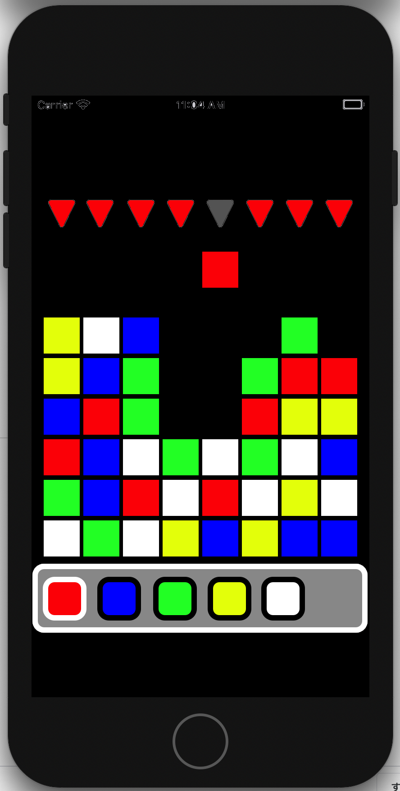
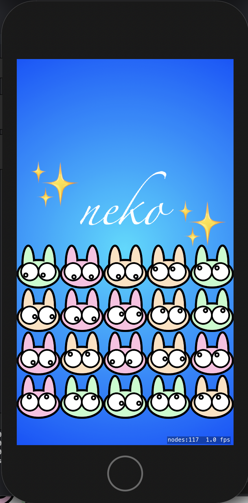

# multi-puzzle
    

## concept
### 協力して遊ぶオンライン落ちゲーです。
これは各プレイヤーが落ちるブロックの色と落ちる場所を選んでブロックを落とします。同じ色のブロックが並ぶと消えて得点になります。ブロックの消滅が連鎖すると高得点になります。誰が何色のブロックをどこに落とすかで、連鎖具合が変わってきます。ランキングを作っておき、１つのステージに何人関わったかの人数ランキング、ブロックの消滅の連鎖ランキング。これらの記録を目指す協力型パズルゲームです。  

## コントリビュータ、共同制作者募集
### contributors
@minmin0530

## 環境
プラットフォーム：iOS  
言語：Swift  
サーバ：Node.js、もしくはDeno
